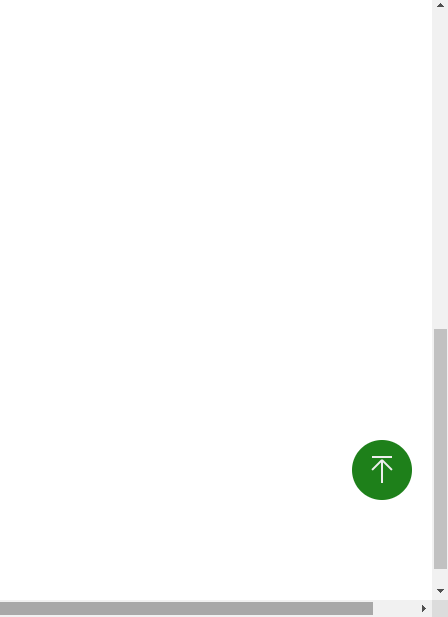

# back2top4vue
It's a component for backing smooothly to top in vue projects. what's more, you can custom color of the component by props.

### props
propName              | default         | type        | description
----------------------|:---------------:|:----------: |:----------:
backgroundColor       | 'green'         | hex or color string. such as 'gray' or '#eeeeee'         |the color of the circle
color                 | 'white'         | hex or color string. such as 'gray' or '#eeeeee'          |the color of the arrow

##### for example
change color and backgroundColor </br>
   


### installation
>```npm i back2top4vue```


### usage
```
<template>
  <div id="container">
    <Back2Top4Vue id="back" color="#eeeeee" backgroundColor="green"></Back2Top4Vue>
  </div>
</template>

<script>
import Back2Top4Vue from "back2top4vue";
export default {
  components: {
    Back2Top4Vue
  }
};
</script>

<style scoped>
#container {
  height: calc(100vh + 800px);
  width: calc(100vw + 200px);
}
#back {
  position: fixed;
  right: 20px;
  bottom: 100px;
  overflow: 999;
}
</style>
```




### license
MIT
